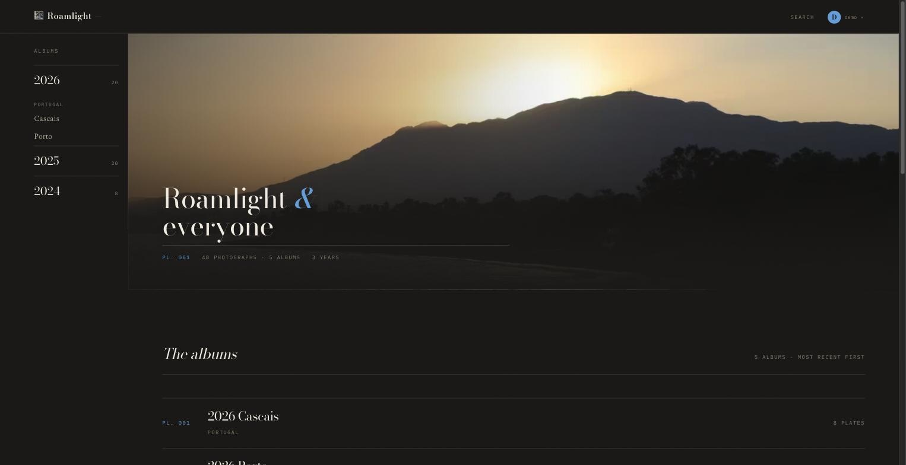
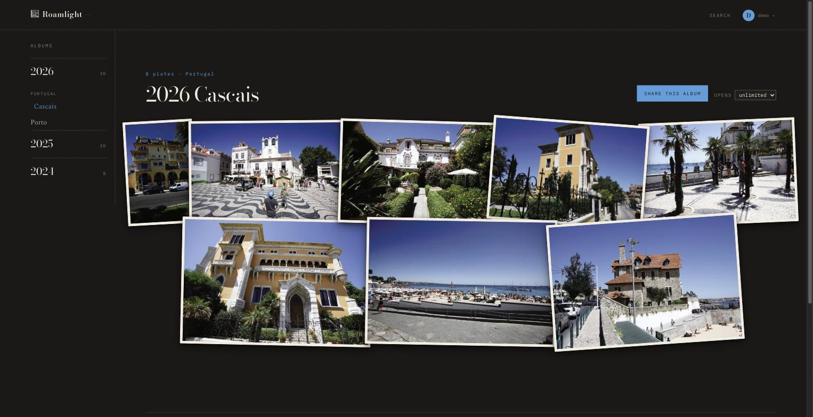
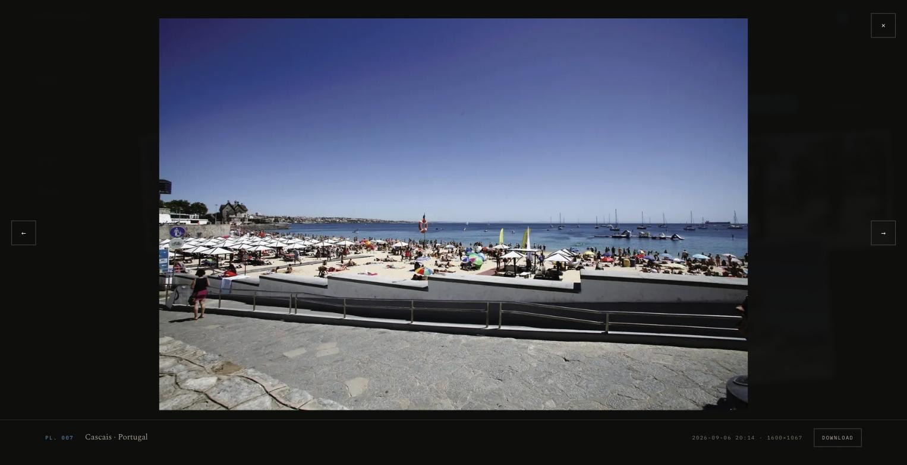
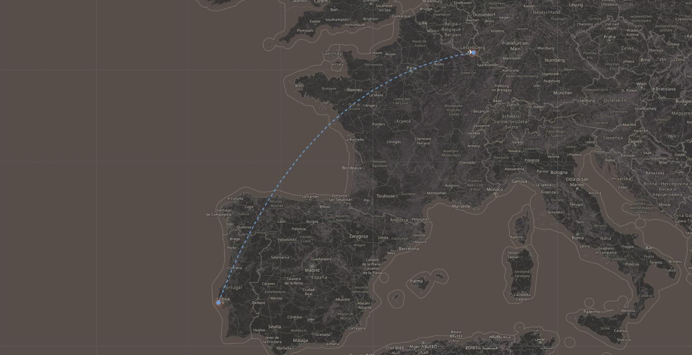
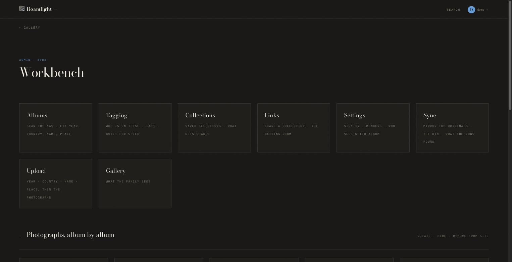

# Roamlight

A photo library for one family, on your own machine.

Point it at the folder where your photographs already live. It builds a web
copy of each one, reads the date, the camera and the place out of the file,
groups everything into albums, and puts the albums on a map. Then it decides,
per album, who in the family may see it. Nothing leaves the house unless you
hand someone a link.

> **roamlight** — *to roam*, and *the light*. Which is what a family album is
> made of: the going somewhere, and what the light left on the film.

---

## What it does

| | |
|---|---|
| **Keeps your originals** | The library folder is read. Masters and web sizes are written somewhere else, so the file off the camera is never touched. |
| **Understands cameras** | JPEG, HEIC, PNG, TIFF — and RAW (CR3, CR2, ARW, NEF, RAF, DNG…) through LibRaw. Video through ffmpeg, with a poster frame. |
| **Serves the right size** | AVIF and WebP at 400 / 800 / 1200 / 2000 / 2800 px, plus a blurred placeholder so a page never jumps while it loads. |
| **Albums, people, tags** | Year → country → album. Tag who is on a photograph and find them again. |
| **A map** | Every album with coordinates, and an optional journey (“car to the airport, plane to Málaga, bus to the coast”) drawn on it. |
| **Who may see what** | Per album, per person. Nothing is visible by default. |
| **Share links** | One collection, one link, a password, an end date, an optional view limit — for people without an account. |
| **Phone and tablet** | Add the site to the home screen (it is a PWA), or use the apps: [`ios/`](ios/) for iPhone and iPad, [`android/`](android/) for Android. |

## Screenshots

|  |  |
|---|---|
|  |  |
| **Everything at once** — years down the side, the albums underneath. | **One album** — the photographs lie on the table, not in a grid. |
|  |  |
| **A photograph** — where and when, and the original to download. | **The journey** — car, plane, bus, drawn between the places. |



**The workbench** — scanning, tagging, collections, share links, who sees which
album, and the mirror of the originals. Only an administrator sees this page.

<sub>Photographs in the screenshots are the author's own, from a demo library —
not from anybody's family album.</sub>

---

## Install

### Docker (recommended)

```bash
curl -fsSLO https://raw.githubusercontent.com/Racoon80/roamlight/main/compose.yaml
# open compose.yaml and point `originals` and `library` at real folders
docker compose up -d
```

Then open `http://<your-machine>:8080`. The first screen asks you to create the
administrator account — until you do, nobody can sign in.

If Docker cannot pull the image, build it yourself — it is the same thing, and
it takes about three minutes:

```bash
git clone https://github.com/Racoon80/roamlight && cd roamlight
docker compose up -d --build
```

⚠ **Until you create that account, anybody who reaches the address can create
it** — that is what "first screen" means. On a network with other people on it,
set `FAMILY_SETUP_TOKEN` to a word of your own first; `/setup` then only answers
to `?t=<that word>`, and you can drop the setting once the account exists. The
service also says so in its log while no account is there.

⚠ **The folders you mount have to be writable by the user the container runs
as** (`PUID`/`PGID`, 1000 by default). An empty folder is taken over on the
first start; one that already holds files is left alone, and the container
refuses to start and tells you which folder and which uid. That refusal is on
purpose: without it, uploads are accepted and then quietly never converted.

⚠ **Set `FAMILY_SITE_URL` to the address people actually type.** It goes into
share links, and a link built from `localhost` is useless to a guest.

⚠ **The volumes matter more than anything else in that file.** The defaults are
named Docker volumes — fine to try it out, wrong for the only copy of your
family's photographs. Use real paths:

```yaml
    volumes:
      - /srv/photos/originals:/originals   # read; your photographs
      - /srv/photos/library:/library       # written; what the site serves
      - data:/data                         # database and derivatives
```

### Proxmox LXC (one command)

Run this **on a Proxmox host**, as root:

```bash
bash -c "$(curl -fsSL https://raw.githubusercontent.com/Racoon80/roamlight/main/deploy/proxmox-lxc.sh)"
```

It asks for the container id, size and network, and **whether to install the
virus scanner** — then builds the container, installs everything, and prints the
address. About five minutes, most of it `apt`.

⚠ You are piping a script from the internet into a root shell. Read it first:
`curl -fsSL <url> | less`. It is 200 lines and it does nothing clever.

### From a checkout

Debian/Ubuntu, Python 3.11+:

```bash
sudo apt install python3-venv libvips42 libimage-exiftool-perl ffmpeg sqlite3
git clone https://github.com/Racoon80/roamlight && cd roamlight
python3 -m venv .venv && .venv/bin/pip install -r requirements.txt
cp deploy/roamlight.env.example .env && $EDITOR .env      # paths, title, auth
set -a && . ./.env && set +a
.venv/bin/uvicorn app.main:app --host 0.0.0.0 --port 8080 --no-proxy-headers
```

---

## Signing in

Two ways, and they work side by side (`FAMILY_AUTH=local+proxy`).

**`local`** — accounts with a password, kept in this site's database. Passwords
are argon2id. The first account you create is the administrator. This is the
default, and for most people it is the whole story.

**`proxy`** — an identity provider in front (Authentik, Authelia,
oauth2-proxy…) authenticates, and passes the user and their groups as headers.

⚠ **Do not switch `proxy` on unless a proxy really is in front and really does
overwrite those headers.** Otherwise anyone can send
`X-authentik-username: you` and be you. When `proxy` is on, the site also
demands a shared secret in `X-Family-Proxy` that only your proxy knows — that
is what makes the header trustworthy. See [`deploy/nginx.conf`](deploy/nginx.conf)
for a worked example.

**Phones** get in a third way: a device token. On `/app` the site shows a QR
code that is good for five minutes and one device; the app scans it and trades
it for a long-lived token. Tokens are listed on that page and can be taken off
in one click — which works even when the phone itself is gone.

---

## Configuration

Everything is environment variables. The ones that matter:

| Variable | Default | What it is |
|---|---|---|
| `FAMILY_AUTH` | `local` | `local`, `proxy`, or `local+proxy` |
| `FAMILY_SITE_TITLE` | `Roamlight` | The name in the masthead and on the home screen |
| `FAMILY_SITE_URL` | `http://localhost:8080` | The address share links are built from |
| `FAMILY_ORIGINS` | `/originals` | Your photographs. Read, not written |
| `FAMILY_WEB` | `/library` | What the site serves. Written |
| `FAMILY_DATA` | `/data` | Database, derivatives, uploads in progress |
| `FAMILY_ADMIN_GROUPS` | `admin` | Group names that mean "sees and manages everything" |
| `FAMILY_VIEWER_GROUPS` | `family` | Group names that mean "may look" |
| `FAMILY_SHARES` | `1` | Share links on or off |
| `FAMILY_CLAMAV` | `0` | Scan every uploaded file (see below) |
| `FAMILY_CLAMAV_HOST` | — | Set it when the scanner is a neighbouring container |
| `FAMILY_WORKERS` | `2` | Conversions at the same time. One takes about ¾ of a core |
| `FAMILY_MAX_MEGAPIXELS` | `50` | A file bigger than this is refused before it is decoded |
| `FAMILY_REQUIRE_MOUNT` | `1` | Refuse to run if the photo folders are not mounted |
| `FAMILY_TRUSTED_PROXIES` | — | Addresses whose `X-Forwarded-For` is believed. See below |
| `FAMILY_CLIENT_IP_HEADER` | `X-Forwarded-For` | Which header carries the visitor's address |

The full list is in [`app/config.py`](app/config.py), where each one says why it
exists.

### The virus scanner

Off by default, because it costs about a gigabyte of memory. Switch it on if
photographs reach you on other people's sticks and phones:

```yaml
  roamlight:
    environment:
      FAMILY_CLAMAV: "1"
      FAMILY_CLAMAV_HOST: clamav      # the service below
  clamav:
    image: clamav/clamav:stable
    volumes: [clamav:/var/lib/clamav]
```

⚠ When the scanner is switched on and cannot be reached, uploads **stop**. A
file that was never looked at is not "clean" — that is the whole point of
switching it on.

---

## How it is built

Python 3.11+, FastAPI, SQLite. No build step, no bundler, no framework in the
browser: the pages are server-rendered HTML with a few small scripts. The heavy
lifting is done by three programs — **libvips** resizes, **exiftool** reads and
writes metadata, **ffmpeg** handles video.

```
app/          the site        (33 modules; config.py is a good place to start)
templates/    the pages       (Jinja2)
static/       CSS, JS, fonts  (self-hosted; the CSP allows nothing from outside)
deploy/       systemd unit, nginx example, the Proxmox installer
ios/          the iPhone and iPad app (SwiftUI)
android/      the Android app (Kotlin, Jetpack Compose)
tests/        checks that run against a real instance
```

The database is one SQLite file. Back that up together with the library folder
and you have backed up everything.

## Security

- Nothing is public. Every page and every image needs an account, except a
  share link — and that is a random token with an optional password and end
  date.
- Uploads are checked by content, not by file name, before anything else
  happens to them.
- Photographs carry GPS. A share link can strip it; family members see it.
- The site sets its own CSP, `X-Frame-Options` and `noindex` on every answer,
  even when a proxy in front forgets to.
- Failed sign-ins are throttled per address, not per account — locking an
  account would let a stranger lock you out of your own site.
- ⚠ **That throttle needs `FAMILY_TRUSTED_PROXIES` to count anybody apart.**
  `X-Forwarded-For` is a header and anyone can type one, so it is believed
  only from the addresses you name there — behind the nginx example that is
  `127.0.0.1`, behind another reverse proxy its address, and ranges like
  `192.168.1.0/24` work. Name nothing and every visitor counts as the proxy:
  one shared counter, which is a nuisance but still a throttle. Behind
  Cloudflare also set `FAMILY_CLIENT_IP_HEADER=CF-Connecting-IP`: that is
  the header Cloudflare sets itself, so it is the one worth reading.
  Whether `X-Forwarded-For` keeps anything the visitor put there depends
  on the account's transform rules — do not build the throttle on a header
  whose handling is a setting somewhere else.

Found something? Open an issue, or write to the address in the repository
profile. Please do not post a working exploit before it is fixed.

## Licence

[AGPL-3.0](LICENSE). Use it, change it, run it for your family. If you run a
changed version as a service for other people, publish your changes.

---

If this is useful to you:

<a href="https://www.buymeacoffee.com/dv7g" target="_blank"></a>
