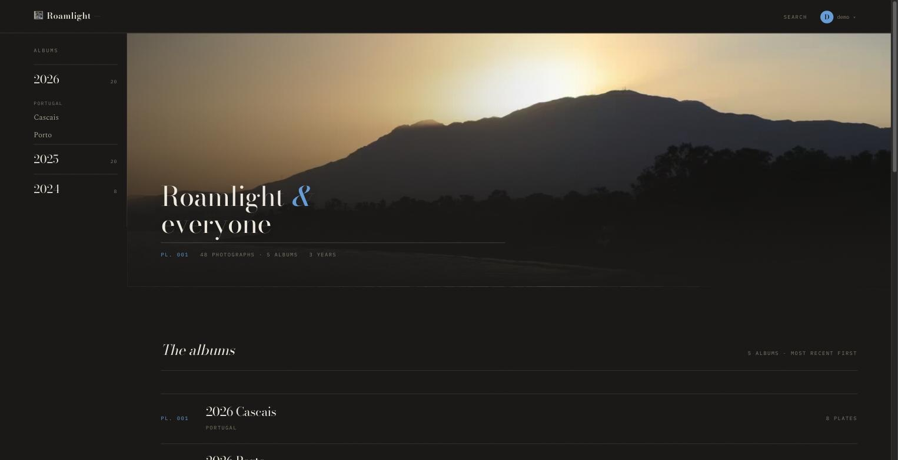
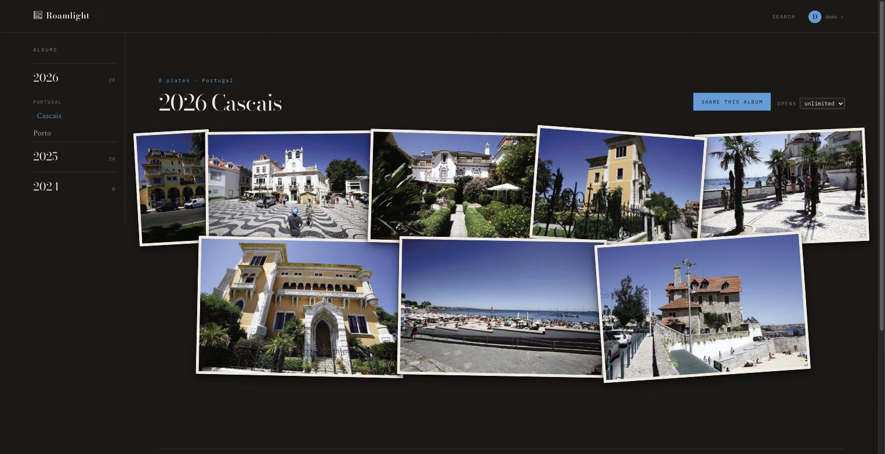
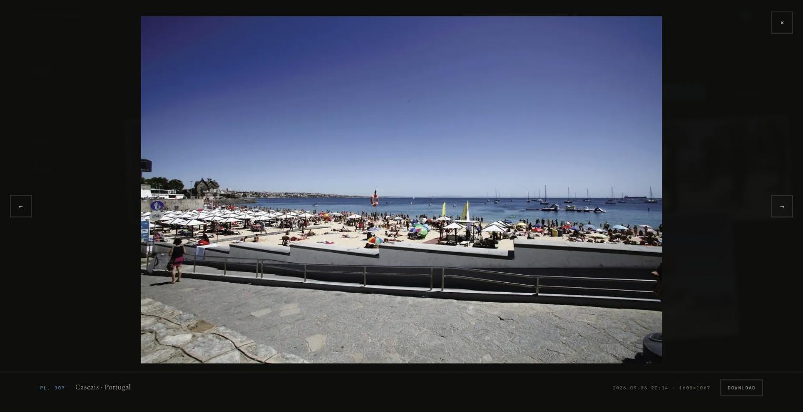
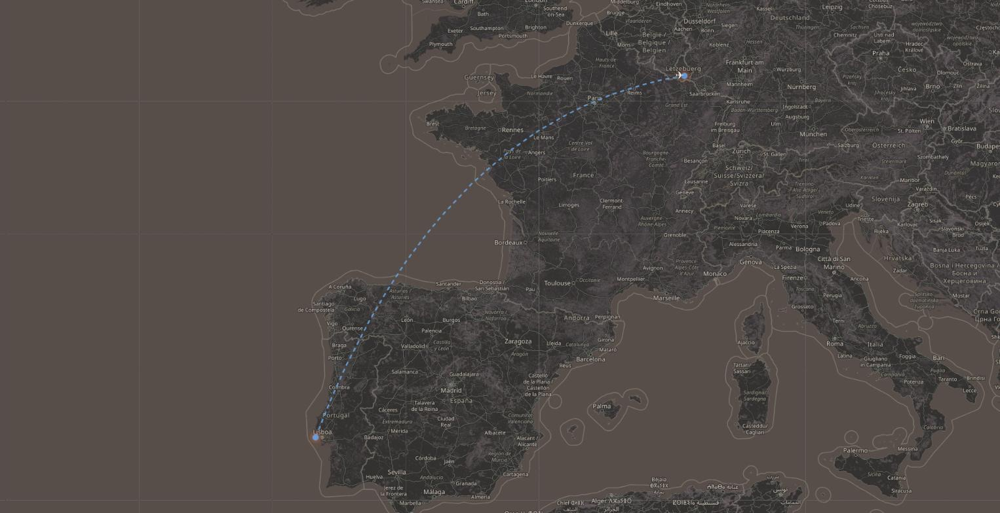
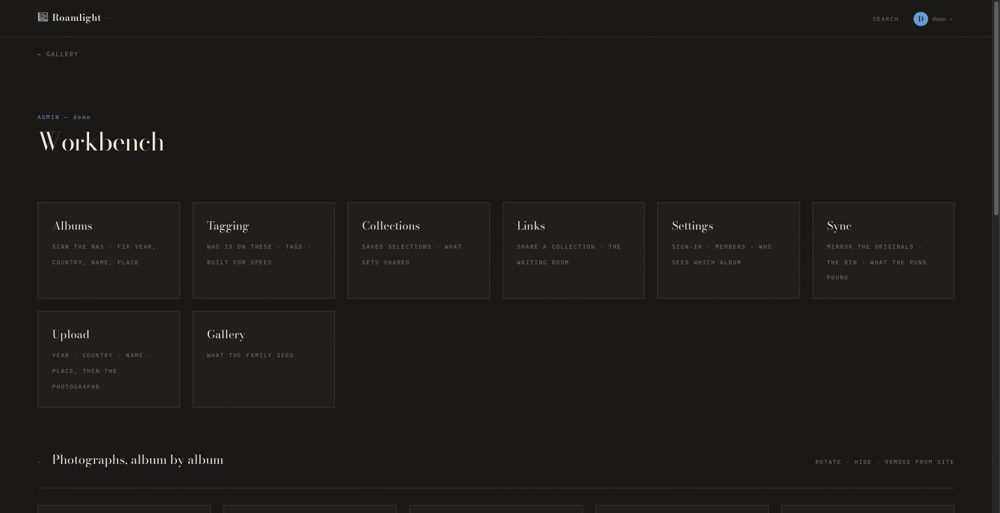

# Roamlight

**Your family's photo album — on your own machine, for your own people.**

[](LICENSE)
[](https://github.com/Racoon80/roamlight/pkgs/container/roamlight)
[](https://apps.apple.com/app/id6809221900)
[](#the-apps)

<a href="https://www.buymeacoffee.com/dv7g" target="_blank"></a>

Point Roamlight at the folder where your photographs already live. It makes a
web copy of each one, reads the date, the camera and the place out of the file,
sorts everything into albums and puts the albums on a map. You decide, album by
album, who in the family may see it — and nothing leaves the house unless you
hand somebody a link.

No cloud, no subscription, no company in between. Just your pictures, looking
their best, for the people they belong to.

> **roamlight** — *to roam*, and *the light*. Which is what a family album is
> made of: the going somewhere, and what the light left behind.

---

## A look inside

|  |  |
|---|---|
|  |  |
| **Everything at once** — the years down the side, the albums underneath. | **One album** — the photographs lie on the table like prints, not in a grid. |
|  |  |
| **A photograph** — where and when, and the original to download. | **The journey** — car, plane, bus, drawn between the places. |



**The workbench** — scanning, tagging, collections, share links, who sees which
album. Only an administrator sees this page.

<sub>The photographs in the screenshots are the author's own, from a demo
library — not from anybody's family album.</sub>

---

## What it does

- 📁 **Leaves your originals alone.** Your photo folder is only ever read. Web
  copies go somewhere else, so the file off the camera is never touched.
- 📷 **Understands your cameras.** JPEG, HEIC, PNG, TIFF, RAW (CR3, CR2, ARW, NEF,
  RAF, DNG…) and video — with a poster frame, playing in the browser and in the
  apps, the right way up.
- ⚡ **Fast pages.** AVIF and WebP in five sizes, plus a blurred placeholder so
  nothing jumps while it loads.
- 🗺️ **Albums on a map**, and an optional journey (“car to the airport, plane to
  Málaga, bus to the coast”) that plays as a little opening animation.
- 👨‍👩‍👧 **Who sees what** — per album, per person or group. Nothing is visible by
  default.
- 🏷️ **People and tags** — mark who is on a photograph and find them again.
- 🔗 **Share links** for people without an account: a password, an end date, an
  optional view limit.
- 🖼️ **Slideshows** — five seconds a photograph, a soft crossfade, a slow drift.
- 🔔 **A word when something arrives** — one line when photographs land in an
  album you can see. A hundred photographs are *one* message, not a hundred.
- 🔐 **Sign in your way** — passwords, or your own single sign-on (Authentik,
  Keycloak, Entra…), in the browser and in the apps.

## The apps

| | |
|---|---|
| **iPhone & iPad** | [**Roamlight on the App Store**](https://apps.apple.com/app/id6809221900) — free. |
| **Android** | Straight from your own Roamlight site: open it in the phone's browser, go to **Phone & tablet** and tap **Download for Android**. No Play Store needed, and the app offers its own updates from then on. |

Both do the whole thing: look, search, slideshow, make an album, add to one,
edit and delete what is yours, share, and play videos. You connect a phone by
scanning a code from the site, with your password, or with single sign-on.

---

## Get started

### Docker

```bash
curl -fsSLO https://raw.githubusercontent.com/Racoon80/roamlight/main/compose.yaml
# open compose.yaml and point `originals` and `library` at your folders
docker compose up -d
```

Open `http://<your-machine>:8080`. The first screen asks you to create the
administrator account — that's it, you're in.

<details>
<summary>Can't pull the image? Build it yourself (about three minutes).</summary>

```bash
git clone https://github.com/Racoon80/roamlight && cd roamlight
docker compose up -d --build
```
</details>

### Unraid

Roamlight is on its way into **Community Applications**. Until it shows up
there, the Docker instructions above work on Unraid as they are.

### Proxmox LXC (one command)

On a Proxmox host, as root:

```bash
bash -c "$(curl -fsSL https://raw.githubusercontent.com/Racoon80/roamlight/main/deploy/proxmox-lxc.sh)"
```

It asks for the container id, size and network, and whether you'd like the
virus scanner — then builds everything and tells you the address. About five
minutes. (It's a good habit to read a script before you run it as root:
`curl -fsSL <url> | less` — it's 200 plain lines.)

### From a checkout

Debian/Ubuntu, Python 3.11+:

```bash
sudo apt install python3-venv libvips42 libimage-exiftool-perl ffmpeg sqlite3
git clone https://github.com/Racoon80/roamlight && cd roamlight
python3 -m venv .venv && .venv/bin/pip install -r requirements.txt
cp deploy/roamlight.env.example .env && $EDITOR .env      # paths, title, sign-in
set -a && . ./.env && set +a
.venv/bin/uvicorn app.main:app --host 0.0.0.0 --port 8080 --no-proxy-headers
```

### Five things worth knowing before you start

1. **Use real folders, not Docker volumes, for your photographs.** The defaults
   are fine for trying it out — your family's only copy deserves a real path:
   ```yaml
       volumes:
         - /srv/photos/originals:/originals   # read; your photographs
         - /srv/photos/library:/library       # written; what the site serves
         - data:/data                         # database and web sizes
   ```
2. **The folders must be writable by the container's user** (`PUID`/`PGID`,
   1000 by default). If they aren't, Roamlight refuses to start and tells you
   which folder — better than accepting uploads it can't convert.
3. **Create the admin account straight away.** Until you do, whoever reaches the
   address can create it. On a shared network, set `FAMILY_SETUP_TOKEN` first;
   `/setup` then only answers to `?t=<your word>`.
4. **Set `FAMILY_SITE_URL`** to the address people actually type — it goes into
   share links.
5. **Back up two things:** the SQLite file in `/data` and your library folder.
   That's everything. See [docs/backup.md](docs/backup.md).

---

## Signing in

Three ways, side by side. Most families use `local` (passwords) — and that's the
whole story for them. If you already run an identity provider, add `oidc`:

```
FAMILY_AUTH=local+oidc
FAMILY_OIDC_ISSUER=https://auth.example.com/application/o/roamlight/
FAMILY_OIDC_CLIENT_ID=…
FAMILY_OIDC_SECRET_FILE=/etc/roamlight/oidc-secret
```

Register `https://<your site>/auth/oidc/callback` with the provider — or skip the
file and fill it all in on **Settings → Sign-in**. Keeping one password account
next to single sign-on is a good idea: it's your way in on the day the provider
is down.

The details, for the curious: PKCE, a one-use `state` tied to the browser, a
`nonce`, and the token's signature, `iss`, `aud` and `exp` checked against the
provider's keys before anything in it is read. A provider account is never
merged onto a password account with the same name. The older `proxy` mode
(headers from an identity proxy) was removed on 08.09.2026 — use `oidc` instead.

**Phones** get their own device token. They connect by scanning a code from
**Phone & tablet** (good for five minutes and one device), with a password, or
with single sign-on — where the site hands the app a one-time code that only
that app can redeem. Every connected phone is listed on that page and can be
taken off in one click, even when the phone itself is lost.

---

## Configuration

Everything is an environment variable. The ones you're most likely to touch:

| Variable | Default | What it is |
|---|---|---|
| `FAMILY_SITE_TITLE` | `Roamlight` | The name in the masthead and on the home screen |
| `FAMILY_SITE_URL` | `http://localhost:8080` | The address share links are built from |
| `FAMILY_ORIGINS` | `/originals` | Your photographs — read, never written |
| `FAMILY_WEB` | `/library` | What the site serves — written |
| `FAMILY_DATA` | `/data` | Database, web sizes, uploads in progress |
| `FAMILY_AUTH` | `local` | `local`, `oidc`, or `local+oidc` |
| `FAMILY_AUTH_LOCK` | `0` | `1` = the settings page can't change how people sign in |
| `FAMILY_OIDC_ISSUER` | — | Your provider, for `oidc` (https, no query string) |
| `FAMILY_OIDC_CLIENT_ID` | — | The client this site is registered as |
| `FAMILY_OIDC_SECRET_FILE` | `/etc/roamlight/oidc-secret` | The client secret (leave out for a public client) |
| `FAMILY_ADMIN_GROUPS` | `admin` | Groups that see and manage everything |
| `FAMILY_VIEWER_GROUPS` | `family` | Groups that may look |
| `FAMILY_OWNER_ALIASES` | — | `adminaccount=person`: what that admin account uploads belongs to that person |
| `FAMILY_SHARES` | `1` | Share links on or off |
| `FAMILY_WORKERS` | `2` | Conversions at the same time (each takes about ¾ of a core) |
| `FAMILY_MAX_MEGAPIXELS` | `50` | Bigger files are refused before they're decoded |
| `FAMILY_REQUIRE_MOUNT` | `1` | Refuse to run if the photo folders aren't mounted |
| `FAMILY_CLAMAV` | `0` | Scan every upload for viruses (see below) |
| `FAMILY_CLAMAV_HOST` | — | Set when the scanner is a neighbouring container |
| `FAMILY_TRUSTED_PROXIES` | — | Addresses whose `X-Forwarded-For` is believed (see Security) |
| `FAMILY_CLIENT_IP_HEADER` | `X-Forwarded-For` | Behind Cloudflare: `CF-Connecting-IP` |
| `FAMILY_TILE_OFFLINE` | `0` | Map tiles from the cache only |
| `FAMILY_NOTIFY_WINDOW` | `90` | Seconds a notice gathers before it goes out |
| `FAMILY_APNS_KEY_FILE` | — | The `.p8` from Apple — for iPhone notices |
| `FAMILY_APNS_KEY_ID` / `_TEAM_ID` / `_TOPIC` | — | The key's id, your team, the app's bundle id |
| `FAMILY_APNS_SANDBOX` | `0` | `1` only for a build straight out of Xcode |
| `FAMILY_FCM_CREDENTIALS` | — | A Firebase service account file — for Android notices |
| `FAMILY_ANDROID_DIR` | `<data>/android` | Where the site keeps the Android app it hands out |

Every setting is in [`app/config.py`](app/config.py), each with a note on why it
exists.

### The virus scanner

Off by default (it wants about a gigabyte of memory). Worth it if photographs
reach you on other people's sticks and phones:

```yaml
  roamlight:
    environment:
      FAMILY_CLAMAV: "1"
      FAMILY_CLAMAV_HOST: clamav
  clamav:
    image: clamav/clamav:stable
    volumes: [clamav:/var/lib/clamav]
```

When it's on and can't be reached, uploads wait — a file nobody looked at is
not "clean".

### Notices on the phone

Two things are worth hearing about: photographs arriving in an album you can
see, and being let into an album. Events are gathered for a minute and a half
and then sent as one line — *“2026 Ostende — 500 new photographs”* — so an
evening's import is one message on the lock screen. Nobody hears about their
own uploads, and nothing is announced before the photographs are ready to look
at.

A message that reaches a closed app has to pass through Apple or Google, so
notices are off until you set them up:

- **iPhone & iPad** — an APNs key (`.p8`) from the Apple developer portal, made
  for *Sandbox & Production*.
- **Android** — a Firebase project and its service account file.

Only the album's title and a count travel that way. Never a name, never a
photograph.

### Handing out the Android app

Build the app, sign it with your own key, and put it on your site:

```bash
python3 tools/publish_android.py Roamlight.apk --code 111 --name 1.1.1
```

The **Phone & tablet** page then offers the download, and phones that already
have the app are offered the update.

---

## How it's built

Python 3.11+, FastAPI and SQLite. No build step and no framework in the browser —
server-rendered pages and a few small scripts. The heavy lifting is done by
**libvips** (resizing), **exiftool** (metadata) and **ffmpeg** (video).

```
app/          the site          (config.py is a good place to start)
templates/    the pages         (Jinja2)
static/       CSS, JS, fonts    (all self-hosted — map tiles included)
deploy/       systemd unit, nginx example, the Proxmox installer
ios/          the iPhone and iPad app (SwiftUI)
android/      the Android app (Kotlin, Jetpack Compose)
tests/        checks that run against a real test instance
tools/        small helpers (publishing the Android app, repairs)
```

The tests only run against an instance marked `FAMILY_TEST=1`, and never as a
user who owns the photographs — so they can't touch a real family library.

## Security

- **Nothing is public.** Every page and image needs an account — except a share
  link, which is a random token with an optional password and end date.
- Uploads are checked by their content, not their name, before anything else.
- Photographs carry GPS. Share links can strip it; family members see it.
- Videos get a short-lived signed address for that one video, because a phone's
  video player can't send a sign-in header ([`app/tickets.py`](app/tickets.py)).
- The site sets its own CSP, `X-Frame-Options` and `noindex` on every answer.
- Failed sign-ins are slowed down per address, not per account — so a stranger
  can't lock you out of your own site. For that to count visitors apart behind
  a reverse proxy, name the proxy in `FAMILY_TRUSTED_PROXIES` (behind the nginx
  example: `127.0.0.1`; ranges like `192.168.1.0/24` work too).

Found something? Please open an issue, or write to the address on the
repository profile — and give us a chance to fix it before posting a working
exploit. Thank you!

## Privacy

[PRIVACY.md](PRIVACY.md) — what the apps keep, what leaves a phone, and to whom.
It's short, because there isn't much.

## Licence

[AGPL-3.0](LICENSE). Use it, change it, run it for your family. If you run a
changed version as a service for other people, share your changes.

---

## Say thanks

Roamlight was made for one family — and now it's there for yours too. If it
brings you joy, a coffee is a lovely way to say so ☕

<a href="https://www.buymeacoffee.com/dv7g" target="_blank"></a>

Stars, issues and ideas are just as welcome.
